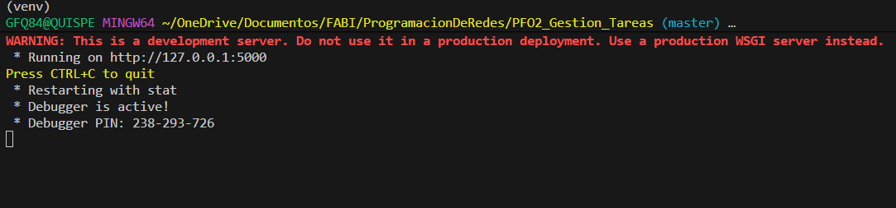
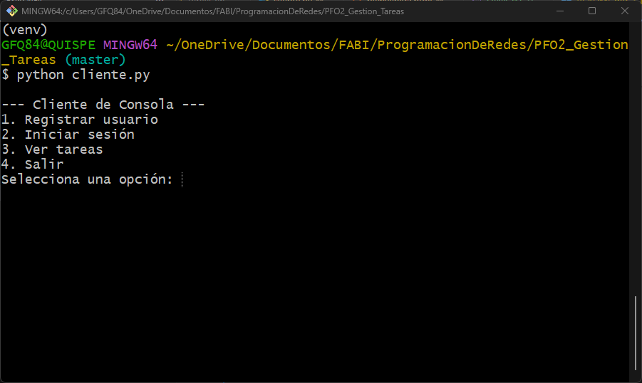
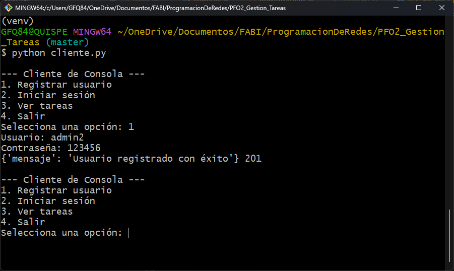
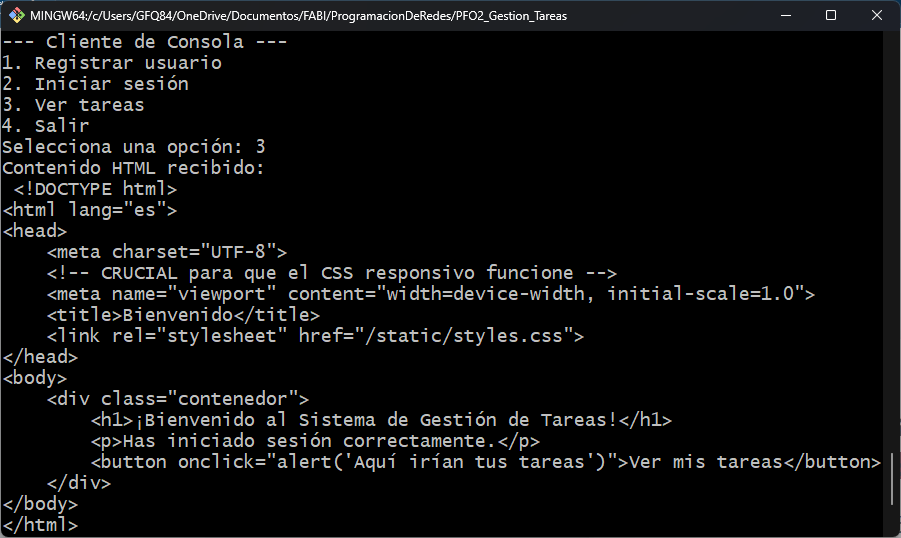
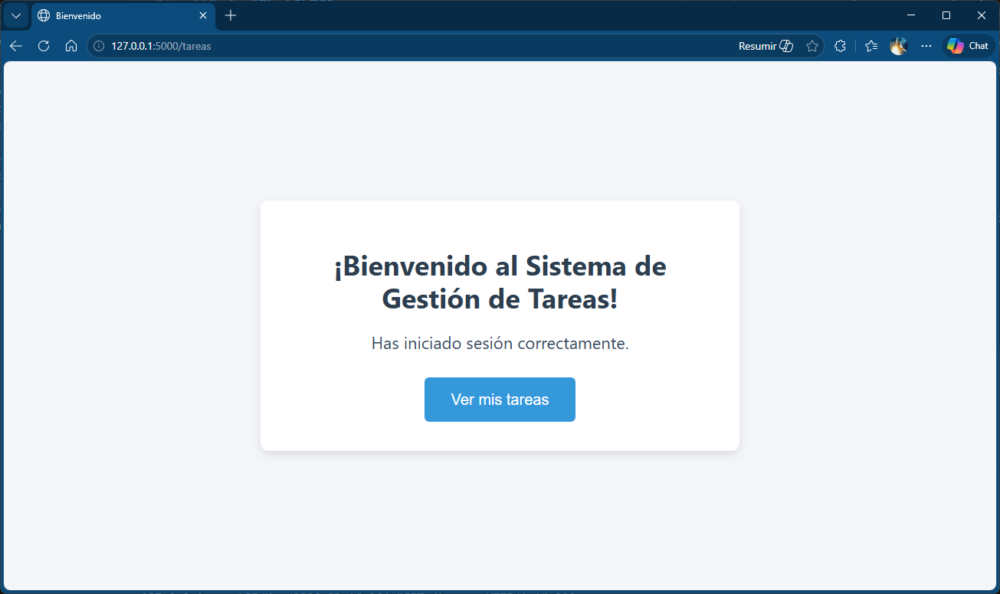

# 📘 README.md — Sistema de Gestión de Tareas (PFO2)

## 📌 Descripción del Proyecto

Este proyecto implementa un **Sistema de Gestión de Tareas** con:

- Un **servidor Flask** que expone una API REST.
- Autenticación básica con contraseñas hasheadas.
- Persistencia de datos en **SQLite**.
- Un **cliente en consola** que interactúa con la API y también abre el navegador para mostrar la página HTML.

---

## 🚀 Instalación

### 1. Clonar el repositorio

```bash
git clone https://github.com/Gefq2021/PFO2_Gestion_Tareas.git
cd PFO2_Gestion_Tareas
```

### 2. Crear entorno virtual

```bash
python -m venv venv
source venv/bin/activate   # Linux/Mac
venv\Scripts\activate      # Windows
```

### 3. Instalar dependencias

```bash
pip install -r requirements.txt
```

Dependencias principales:

- **Flask** → servidor web.
- **Werkzeug** → hasheo de contraseñas.
- **Requests** → cliente HTTP en consola.

---

## ▶️ Ejecución del Proyecto

### 1. Iniciar el servidor

```bash
python servidor.py
```

El servidor se levantará en `http://127.0.0.1:5000`.



---

### 2. Ejecutar el cliente

En otra terminal:

```bash
python cliente.py
```



---

### 3. Registrar un usuario

Selecciona la opción **1** en el cliente y completa usuario/contraseña.  
El servidor responderá con un mensaje de éxito.



---

### 4. Iniciar sesión

Selecciona la opción **2** en el cliente y completa usuario/contraseña.  
El servidor responderá con un mensaje de login exitoso.


### 5. Ver tareas

Selecciona la opción **3** en el cliente:

- En la **consola** verás el HTML recibido como texto plano.  
- En el **navegador** se abrirá automáticamente la página renderizada con estilos.

**Captura 1:** consola mostrando el HTML.  



**Captura 2:** navegador mostrando la página web con estilos.  



---

## 📂 Estructura del Proyecto

```txt
PFO2_Gestion_Tareas/
├── servidor.py          # API Flask con SQLite
├── cliente.py           # Cliente en consola
├── templates/
│   └── bienvenida.html  # Página HTML
├── static/
│   └── styles.css       # Estilos CSS responsivos
├── database/
│   └── tareas.db        # Base de datos SQLite
├── requirements.txt     # Dependencias
├── .gitignore
└── README.md
```

---

## 📌 Conceptos Clave

- **Hasheo de contraseñas:** se usa `werkzeug.security` para proteger las contraseñas. Nunca se almacenan en texto plano.
- **SQLite:** base de datos ligera que se crea automáticamente en `database/tareas.db`.
- **Cliente dual:** muestra resultados en consola y abre el navegador para visualizar la página HTML.

---

## 👤 Autor

- **N. y A:** Quispe, Gerardo Fabián  
- **Fecha de entrega:** Mayo 2026  
